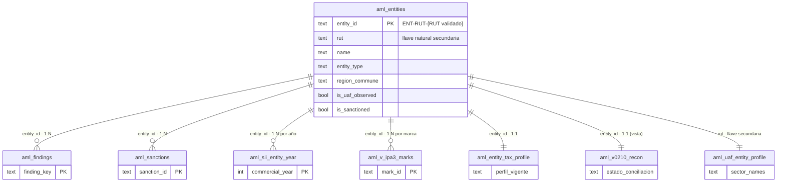
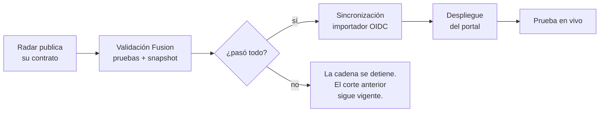
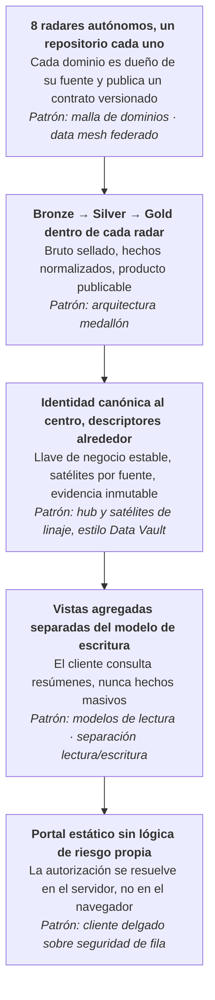

# Gobierno del sistema ATLAS AML · resumen para comité

**Versión del sistema al corte:** ATLAS AML v0.42.0 (build 0420)
**Fecha del documento:** 2026-08-19
**Alcance:** AML-Workbench-Portal y los 11 componentes que lo alimentan

Este documento explica, en términos simples, cómo está gobernado el sistema: qué es,
cómo se estructura la información, con qué herramientas está construido, cómo se
actualiza y qué reglas metodológicas lo limitan. No es documentación técnica de
implementación; es una descripción de los criterios de control.

---

## 1. Qué es el sistema y qué no es

ATLAS AML es una **plataforma de priorización analítica** construida exclusivamente
sobre **información pública oficial chilena** (OSINT). Toma datos dispersos de
organismos del Estado, los normaliza, los cruza sobre una identidad común y los
presenta a un analista con la evidencia de origen siempre adjunta.

**Qué produce:** una cola ordenada de trabajo. Le dice al analista *qué revisar
primero* y *por qué*, con el documento oficial que respalda cada afirmación.

**Qué no produce:** una acusación, una calificación de delito ni una probabilidad
de lavado de activos. La regla escrita en el código, en la documentación y en la
propia interfaz es:

> **Prioridad analítica ≠ probabilidad de delito.**

Esta distinción no es un descargo de responsabilidad decorativo: está implementada
como restricción técnica en cada capa del sistema (ver sección 9).

---

## 2. La cadena de gobierno del dato

Toda la arquitectura obedece a una sola regla de evolución, idéntica en los once
repositorios:

```
FUENTE OFICIAL → SNAPSHOT SELLADO → HECHO NORMALIZADO → ENTIDAD CANÓNICA
    → SEÑAL / MARCA → HALLAZGO → EVIDENCIA Y LINAJE
```

Los cinco eslabones que importan para el comité:

| Etapa | Qué ocurre | Control aplicado |
|---|---|---|
| **1. Captura** | Un "radar" descarga el bulk oficial publicado por el organismo | Se registra URL, SHA-256, tamaño, fecha, metadatos HTTP y cobertura declarada de cada descarga |
| **2. Normalización** | El dato bruto se convierte en hechos comparables | Capas bronze (bruto) / silver (hechos) / gold (publicación), con carga idempotente |
| **3. Fusión** | Los radares se cruzan sobre una identidad común | Solo por RUT exacto validado; nunca por similitud de nombre |
| **4. Materialización** | Se publica un corte autorizado en base de datos | Vistas agregadas, no copia masiva de hechos al navegador |
| **5. Consumo** | El portal muestra hallazgos priorizados | Cada número puede abrir "Cómo se calculó" y su evidencia |

**Principio de no duplicación:** el portal nunca descarga bases masivas. Los radares
publican *contratos compactos* (hechos, señales, evidencia y linaje) y solo eso viaja
hacia arriba. Radar SII, por ejemplo, mantiene millones de filas empresa-año, pero
al portal solo llega un perfil proyectado.

---

## 3. Los componentes del sistema

Once repositorios independientes, cada uno con su propio ciclo de vida, unidos por
contratos versionados.

### Radares productores de hechos

| Componente | Fuente oficial | Qué aporta |
|---|---|---|
| **Radar SII** | Servicio de Impuestos Internos | Historia empresa-año 2020-2024, tramos de ventas, trabajadores, domicilios, actividades económicas, composición societaria |
| **Radar UAF** | Unidad de Análisis Financiero + datos.gob.cl | Registro de sujetos obligados, estadísticas ROS/ROE, normativa y circulares, listas ONU |
| **Radar Sanciones** | UAF, CMF, SP, SUSESO, SCJ, SMA/SNIFA | Eventos sancionatorios 2020-hoy, regulador, materia, recurrencia |
| **Radar CGR** | Contraloría General de la República | Hallazgos de auditoría, temporalidad, enforcement, remisiones a MP/CDE, alertas FAU |
| **Radar OSFL** | SII, Registro Civil, SEGEGOB, Ley 19.862, Ley 21.440, IND, DT | Universo de organizaciones sin fines de lucro y cribado FATF R.8 |
| **Radar Presupuesto Abierto** | DIPRES · Presupuesto Abierto | Gasto público, proveedores, pagos, concentración y anomalías de gasto |
| **Radar Delictual / CEAD Pipeline** | CEAD · Subsecretaría de Prevención del Delito | Estadística delictual comunal acotada al artículo 27 de la Ley 19.913 |
| **Radar Prensa** | Medios públicos | Recurrencia y momentum informativo — **solo contexto** |

### Capas transversales

| Componente | Rol |
|---|---|
| **Context Hub** | Códigos territoriales y sectoriales comunes, benchmarks económicos de pares. Provee contexto, nunca hechos ni calificación |
| **Intelligence Fusion Layer** | Capa canónica: consume los productos gobernados de cada radar, resuelve identidad, aplica el registro de reglas y produce el hallazgo canónico |
| **AML-Workbench-Portal** | Frontend autenticado que consume el corte materializado. No calcula riesgo por su cuenta |

### Estado declarado de integración

El sistema publica explícitamente qué está integrado y qué no, en lugar de aparentar
cobertura completa:

- **Integrados como productores de hallazgos:** SII, UAF, OSFL, Sanciones.
- **Verificados en Fusion, aún no productores de hallazgos:** CGR, Delictual.
- **Contexto separado, no participa del score:** Prensa, Context Hub.
- **Adaptador Fusion pendiente:** Presupuesto Abierto (se consume de forma nativa
  en el portal, pero declarado como no canónico en Fusion).

---

## 4. El modelo de datos

### 4.1 Ocho objetos canónicos

Todo el sistema, en los once repositorios, habla el mismo idioma de ocho objetos:

| Objeto | Qué representa |
|---|---|
| **Entity** | Identidad estable de una persona u organización. El rol no define la identidad |
| **Event** | Un hecho observado o derivado, con su ventana temporal |
| **Relationship** | Un vínculo, clasificado como observado, derivado o inferido |
| **Evidence** | El linaje hasta el productor y el documento oficial de origen |
| **TemporalContext** | Separa *cuándo ocurrió* de *cuándo lo supimos* |
| **Signal** | Una regla analítica versionada de priorización |
| **ContextSignal** | Contexto que nunca modifica un score AML |
| **AMLScore** | Amenaza, vulnerabilidad y exposición — con confianza y cobertura **separadas** |

### 4.2 Cómo se relacionan las tablas

El modelo materializado tiene forma de **estrella de identidad**: una tabla central de
entidades y un anillo de tablas satélite que la describen desde ángulos distintos.
Ninguna tabla satélite se cruza con otra directamente: todas pasan por el centro.



**Lectura del diagrama.** Las cuatro primeras tablas describen a una entidad *muchas
veces* (varios hallazgos, varias sanciones, un registro por año comercial, varias
marcas de prioridad). Las tres últimas la describen *una sola vez*. El perfil UAF se
une por **RUT** y no por `entity_id`, porque la fuente publica RUT pero no el
identificador canónico.

### 4.3 Lo que deliberadamente NO se relaciona

Dos tablas del modelo **no tienen llave de entidad, por diseño**:

| Tabla | Llave real | Por qué no se une a una entidad |
|---|---|---|
| `aml_pattern_alerts` | `scope_type` + `scope_id` (sector o región) | Un patrón sectorial describe un fenómeno agregado. Darle llave de entidad permitiría atribuir a una empresa el comportamiento de su sector |
| `aml_reporting_rules` | `sector_name` | Es la obligación normativa de un sector bajo la Ley 19.913, no un dato de la entidad |

Esta es **la decisión de gobierno más importante del modelo**: al no existir la
columna que permitiría el cruce, la atribución indebida no es una mala práctica
evitable, sino una operación técnicamente imposible.

### 4.4 La llave de identidad

`entity_id = ENT-RUT-{RUT normalizado}`

Reglas duras de identidad:

- El RUT se usa **solo tras validar su dígito verificador**.
- El nombre normalizado **apoya** el cruce, nunca lo reemplaza.
- Una relación societaria requiere **ambos extremos** con RUT exacto.
- Sin identidad exacta, un registro queda como *candidato* y no se promueve.

Este es el criterio más importante del modelo: **el sistema prefiere no cruzar antes
que cruzar mal.**

### 4.5 La unidad de análisis: el hallazgo

La pantalla no muestra registros de base de datos: muestra **hallazgos**. Cada uno
declara obligatoriamente su tipo, alcance, ventana temporal, métricas, productores,
identificadores de evidencia, explicación y estado.

La regla de lectura visible en la interfaz es:

```
hecho → cálculo → evidencia → interpretación
```

Un resultado analítico **sin identificadores de evidencia es inválido** por
definición del esquema. No se puede publicar una conclusión sin su respaldo.

### 4.6 Magnitudes al corte auditado (2026-08-17)

47.186 entidades · 18.231 hallazgos · 974 sanciones · 95 patrones · 37.164 perfiles
OSFL · 9.911 sujetos obligados UAF 2025 · 21.828 ROS 2025 en 48 sectores.

---

## 5. Herramientas utilizadas

Un criterio explícito de diseño: **sin servidores propios y sin costo de
infraestructura permanente.**

| Capa | Herramienta | Por qué |
|---|---|---|
| Orquestación y ejecución | **GitHub Actions** | Cada actualización es un workflow versionado, auditable y reproducible; queda registro de cada corrida |
| Publicación de radares | **GitHub Pages** | Cada radar publica su tablero y sus contratos de datos como sitio estático |
| Procesamiento | **Python 3.12, DuckDB, Parquet** | Volúmenes grandes procesados en la corrida, sin base de datos operacional |
| Almacenamiento analítico | **Supabase (PostgreSQL)** | Corte materializado con seguridad a nivel de fila |
| Ingreso gobernado | **Supabase Edge Function + GitHub OIDC** | El importador se autentica con token efímero; no existen credenciales privilegiadas almacenadas |
| Identidad | **Microsoft Entra ID** vía Supabase Auth | Autenticación corporativa |
| Interfaz | **HTML/CSS/JavaScript estático** | Sin framework, sin build; el navegador nunca posee credenciales privilegiadas |
| Contratos entre componentes | **JSON / JSONL / YAML versionados** | Cada integración es un archivo revisable, no una convención implícita |

---

## 6. Seguridad y control de acceso

El acceso se controla en cuatro puertas sucesivas:

1. **Autenticación** — Microsoft Entra ID.
2. **Autorización** — la cuenta debe estar habilitada en la tabla `aml_allowed_users`.
   *Autenticarse no otorga acceso*: si la cuenta no está habilitada, la sesión es
   válida pero los datos permanecen cerrados.
3. **Row Level Security** — PostgreSQL filtra las filas en el servidor, no en el
   navegador.
4. **Privilegios mínimos** — el rol anónimo no tiene ningún permiso sobre el modelo
   AML; el rol autenticado es de **solo lectura**, con la única excepción de poder
   insertar en la bitácora de auditoría.

Controles adicionales:

- **Bitácora de auditoría:** cada sesión y cada búsqueda se registran. El texto
  buscado **no se persiste**: se guarda su SHA-256 y su longitud.
- **Content Security Policy** estricta en el documento, con lista blanca de destinos
  y prohibición de manejadores en línea, validada en CI.
- **Sin secretos en el repositorio:** el repositorio es público y no contiene datos
  AML. Solo lleva la URL del proyecto y la clave publicable de Supabase, diseñada
  para uso en cliente.
- **Enlaces de evidencia saneados** a `http`/`https` antes de renderizarse.

---

## 7. Procesos de actualización

### 7.1 Cadencia por fuente

Cada radar se actualiza al ritmo real de publicación de su fuente, no a un ritmo
uniforme artificial:

| Componente | Frecuencia |
|---|---|
| Radar Sanciones | Diaria, días hábiles |
| Radar Delictual | Diaria (dos ventanas) |
| Radar OSFL | Semanal (lunes) |
| CEAD Data Pipeline | Semanal (lunes) |
| Context Hub | Semanal (lunes) |
| Radar UAF (perfil sectorial) | Dos veces al día |
| Radar SII | Mensual |
| Presupuesto Abierto | Mensual |
| Fusion → Supabase | Encadenada a la validación de Fusion |
| Snapshots de runtime | Cada hora |

Todos admiten además ejecución manual.

### 7.2 La compuerta: nada llega a producción sin pasar la validación



La validación no es un informe: es una **compuerta**. Un snapshot que no pasa las
pruebas nunca llega a la base analítica, y el corte anterior permanece disponible sin
degradarse. Esto significa que el sistema puede quedar *desactualizado*, pero no puede
quedar *incorrecto* por una carga fallida.

Puntos de control adicionales:

- El importador verifica que el universo sincronizado sea coherente antes de
  continuar (por ejemplo, exige más de mil entidades).
- Al final se escribe un **sello de sincronización** (`aml_sync_state`) con el
  identificador de corrida, el SHA del código, el identificador de snapshot y las
  marcas de tiempo.

### 7.3 Los tres relojes

El sistema distingue explícitamente tres tiempos que suelen confundirse:

1. **Corte de la fuente** — hasta cuándo llega el dato que el organismo publicó.
2. **Captura del radar** — cuándo el radar lo descargó.
3. **Sincronización del Workbench** — cuándo se materializó en el portal.

La interfaz los muestra por separado y marca "Fuente más nueva que Workbench" cuando
corresponde, en lugar de aparentar frescura. **La frescura se informa como dimensión
propia y no se convierte en riesgo.**

### 7.4 Degradación explícita

Cuando una fuente falla, el sistema lo dice en pantalla y conserva lo que sí tiene.
No rellena por inferencia. Ejemplos implementados: si falla el extracto tributario,
la ficha muestra la ausencia; si falla la identidad gobernada, se conserva la
evidencia del radar y se advierte que la materialización está pendiente.

---

## 8. Control de calidad y despliegue

### Validación automatizada

Ocho workflows de validación se ejecutan sobre cada cambio del portal. No solo
verifican sintaxis: **verifican que los contratos semánticos sigan vigentes**. Por
ejemplo, se comprueba que el catálogo territorial declare exactamente 55 actividades
de la Ley 19.913, que los pesos del índice territorial no hayan cambiado, que el
registro UAF mantenga sus 48 sectores y sus totales, y que Presupuesto Abierto
declare granularidad `PARTIDA_CAPITULO` y base de pago `FECHA_PAGO_AND_MONTO_PAGO`.

Si alguien cambia un peso metodológico sin actualizar la documentación y el contrato,
**el despliegue falla**.

### Política de versión única

Una sola versión está activa en producción (`SINGLE_ACTIVE_RELEASE`). Las versiones
anteriores permanecen en el historial de Git pero **no pueden reclamar el runtime**.
Un guardián en el cliente compara la versión cargada contra el manifiesto publicado y
fuerza recarga si detecta una copia obsoleta en caché. Tras cada despliegue se ejecuta
un *smoke test* contra el sitio realmente publicado y el resultado se persiste como
estado verificable.

### Modelos en sombra

El score de prioridad de entidad **IPA 3.0** está en estado `shadow`
(`production_enabled = false`): se calcula en paralelo, se compara contra el anterior
y se audita, pero **no gobierna decisiones** hasta ser aprobado. Es el criterio de
gobierno más conservador del sistema: un modelo nuevo no entra en producción por el
solo hecho de estar implementado.

### Integridad verificada al corte

0 RUT duplicados tras normalización · 0 hallazgos huérfanos · 0 sanciones resueltas
huérfanas · 0 duplicados entidad-año · 0 scores fuera del rango 0-100.

---

## 9. Clasificación del modelo empleado

El sistema no responde a un único patrón de arquitectura, sino a **cinco patrones
apilados**, cada uno resolviendo un problema que el anterior no puede. Nombrarlos
permite comparar esta solución con alternativas conocidas y evaluar si la elección
fue correcta.



Transversal a las cinco capas: **contratos declarados por esquema y verificados en
integración continua**.

La capa del hub es la que carga con la semántica AML: es donde se decide qué se cruza
con qué.

### Nombre corto de la arquitectura

> **Malla federada de dominios con hub canónico de identidad, gobernada por contratos
> y servida mediante modelos de lectura.**

### Lo que este modelo deliberadamente no es

| No es | Por qué se descartó |
|---|---|
| **Un data warehouse dimensional** (esquema estrella clásico) | Obligaría a definir "riesgo" como una medida sumable. El sistema sostiene lo contrario: las señales de distinta semántica no se suman |
| **Un lago de datos central** | Copiar todas las fuentes a un repositorio único crea un cuello de botella de gobierno y pierde la procedencia por fuente |
| **Una base de grafos** | Las relaciones existen como objeto canónico, pero la cobertura de identidad todavía no justifica un motor de grafo. Es una decisión de secuencia, no de rechazo |
| **Un motor de scoring único** | Exigiría mezclar amenaza, contexto y cobertura en un solo número, que es exactamente lo que los guardrails prohíben |

---

## 10. Ventajas y desventajas de esta elección

Toda arquitectura compra una propiedad y paga con otra. Estas son las que este diseño
compró y las que está pagando.

### Lo que se gana

1. **Auditabilidad por construcción.** Toda cifra se puede rastrear hasta un snapshot
   sellado con su hash y su URL de origen. No depende de que alguien documente bien:
   está en la estructura.
2. **Radio de daño acotado.** Si un radar se rompe o su fuente cambia, los demás
   siguen funcionando y el portal declara la degradación. No hay un proceso central
   que caiga entero.
3. **Seguridad semántica estructural.** Al mantener el grano de cada fuente y no dar
   llave de entidad a lo que es sectorial, muchos errores de interpretación se vuelven
   técnicamente imposibles, no solo desaconsejados.
4. **Reproducibilidad.** Cualquier corte pasado puede reconstruirse a partir del
   snapshot sellado y la versión del código. Un resultado cuestionado se puede
   reproducir.
5. **Costo de infraestructura cercano a cero.** Sin servidores propios, sin base
   operacional permanente, sin licencias. El costo es el tiempo de desarrollo.
6. **El cambio metodológico es visible.** Los pesos y catálogos están declarados en
   contratos verificados en integración continua. Nadie puede cambiar una fórmula en
   silencio.
7. **Evolución por partes.** Se puede incorporar una fuente nueva sin rediseñar el
   modelo, porque el contrato de productor ya está definido.

### Lo que se paga

1. **Latencia estructural.** No hay tiempo real ni lo puede haber. Entre la
   publicación oficial y la pantalla hay una cadena de etapas, y las cadencias son
   heterogéneas: el corte nunca es simultáneo entre dominios. Los "tres relojes" hacen
   visible el problema, no lo eliminan.
2. **Alta complejidad operativa.** Once repositorios y cerca de cuarenta workflows.
   Un cambio de esquema en una fuente obliga a tocar contrato, adaptador, validación y
   documentación. El costo de coordinación crece más rápido que el número de fuentes.
3. **Dependencia de una sola plataforma.** GitHub es simultáneamente cómputo,
   almacenamiento, transporte y publicación. Los datos sobreviven a una caída, pero la
   operación completa se detiene.
4. **La identidad conservadora cuesta cobertura.** Exigir RUT exacto elimina los
   falsos vínculos, pero pierde todo cruce donde la fuente no publica RUT. El caso
   declarado es CGR. El sistema acepta no ver antes que ver mal — y eso son falsos
   negativos.
5. **Sin score único, más carga sobre el analista.** La decisión metodológicamente
   correcta traslada al analista el trabajo de integrar semánticas distintas. Escala
   mal si el número de indicadores sigue creciendo.
6. **Validaciones frágiles ante refactorización.** Varios controles verifican
   literales exactos del código fuente. Son un candado eficaz contra cambios
   silenciosos, pero un renombre inocuo rompe la integración continua.
7. **Cobertura desigual y visible.** Al no forzar integraciones, hay productores
   verificados que aún no generan hallazgos. Es honesto, pero el usuario ve un sistema
   parcialmente vacío.
8. **Deuda técnica acumulada en la interfaz.** Más de cien capas versionadas se cargan
   de forma secuencial. Está reconocida en la auditoría interna, con plan de
   consolidación pendiente.

### Lectura de conjunto

La elección es **coherente con el propósito declarado**. Un sistema cuyo producto es
la priorización defendible de trabajo analítico —y no la detección automática—
necesita trazabilidad y separación semántica más que velocidad o cobertura máxima.
Este diseño optimiza exactamente eso, y paga con latencia, complejidad operativa y
falsos negativos.

La pregunta relevante para el comité no es si la arquitectura es correcta hoy, sino
**bajo qué condición dejaría de serlo**. Hay tres:

- Si se exigiera **detección en tiempo real** o alertas operativas, la cadena por
  lotes sería inadecuada y habría que introducir un canal de eventos.
- Si la pregunta analítica dominante pasara a ser de **redes y varios saltos** —quién
  se relaciona con quién a través de terceros—, el modelo relacional actual quedaría
  corto frente a un motor de grafo.
- Si el número de fuentes creciera de forma significativa, el **costo de coordinación
  entre repositorios** superaría el beneficio de la autonomía, y convendría consolidar
  la orquestación.

Ninguna de las tres condiciones se cumple hoy. Las tres son plausibles a mediano plazo
y conviene monitorearlas explícitamente.

---

## 11. Criterios metodológicos permanentes (guardrails)

Estas reglas están escritas en el código, verificadas en CI y visibles en la
interfaz. Son el núcleo del gobierno del sistema.

### Sobre la ausencia de dato

- **`missing ≠ 0`.** Un dato ausente permanece nulo. No participa como cero en
  promedios, percentiles ni ponderaciones. En pantalla se muestra como `—`.
- Los pesos se renormalizan **solo entre componentes efectivamente observados**.
- **Falla de fuente ≠ ausencia del fenómeno.**

### Sobre la naturaleza de los indicadores

- **Prioridad analítica ≠ probabilidad de delito.**
- **Índice comparativo ≠ probabilidad de LA/FT.**
- **Confianza y cobertura describen la calidad de la evidencia, no el riesgo.** Nunca
  aumentan un score.
- **Más fuentes = más visibilidad, no más riesgo.**

### Sobre la interpretación jurídica

- **Sanción administrativa ≠ lavado de activos.**
- **Actividad económica SII ≠ condición jurídica de sujeto obligado UAF.** La
  actividad es un proxy de universo potencial para cribado, no una determinación
  legal.
- **No observado en el corte público UAF ≠ no inscrito ni no obligado.**
- **Silencio ROS agregado ≠ incumplimiento de una entidad individual.** La estadística
  sectorial no se atribuye a un contribuyente.
- **Pertenencia OSFL o alcance FATF R.8 ≠ señal adversa.**
- **Condición de entidad pública = contexto, no señal adversa.**

### Sobre la propagación de riesgo

- **El riesgo no se hereda.** Una relación societaria, la co-localización o un
  fenómeno sectorial no transmiten riesgo a una entidad.
- **El contexto territorial no se atribuye a entidades por ubicación.** La
  criminalidad de una comuna no es un atributo de quien tiene domicilio en ella.
- **La prensa no acredita hechos** ni modifica ningún score AML. Está confinada a
  señales `CONTEXT_ONLY`, con prueba automatizada de que agregar o quitar una señal
  contextual **no altera byte a byte** las señales AML ni los scores canónicos.

### Sobre la construcción de scores

- **No existe un score universal** que mezcle señales de semántica distinta. Es una
  decisión de arquitectura explícita y documentada.
- **La repetición no suma puntos.** Una marca gobernada se calcula una vez por
  entidad; múltiples alertas del mismo fenómeno son evidencia de intensidad, no
  puntos adicionales.
- **No se fabrica historia.** Las series temporales se calculan desde la fecha real
  del evento, nunca desde la fecha de actualización del registro.
- Las fuentes que no fueron incorporadas a una fórmula tienen **aporte cero
  explícito**, no un peso inventado. En el índice territorial IRG, por ejemplo,
  Presupuesto Abierto, CGR, sanciones, prensa y OSFL aparecen como evidencia
  complementaria con aporte declarado de 0%.

---

## 12. Cómo leer los indicadores

El sistema publica varios números 0-100 con **semánticas deliberadamente distintas**,
que nunca se suman entre sí:

| Indicador | Qué mide | Qué NO significa |
|---|---|---|
| **IPA 3.0** | Prioridad de revisión de una entidad | Probabilidad de LA/FT. Está en modo sombra |
| **IRG-LA/FT** | Índice de riesgo territorial: 45% vulnerabilidad sectorial + 20% densidad de sujetos obligados + 20% brecha de cobertura + 15% amenaza delictual | Riesgo de las entidades ubicadas en ese territorio |
| **IER** | Exposición relativa de una entidad en materia sancionatoria | Culpabilidad ni materia LA/FT |
| **Cobertura Fusion / Workbench** | Madurez técnica de la integración | Indicadores AML — son métricas de ingeniería |
| **Confianza** | Calidad y alcance de la evidencia disponible | Nivel de riesgo |

Además, los scores operativos se presentan **de a uno según el objetivo** del
analista (Explorar, Fiscalizar o Investigar), para evitar la lectura simultánea de
métricas no comparables.

---

## 13. Limitaciones reconocidas

El sistema documenta sus propias brechas en lugar de ocultarlas. Las principales al
corte actual:

1. **Presupuesto Abierto** no tiene adaptador Fusion completo; se consume de forma
   nativa en el portal pero está declarado como no canónico en la capa de fusión.
2. **CGR y Radar Delictual** están verificados en Fusion pero aún no producen
   hallazgos en la materialización que consume el portal.
3. **IPA 3.0 permanece en sombra**, sin efecto productivo.
4. **Radar Sanciones declara 2020-2023 como backfill pendiente**, para no confundir
   falta de carga con ausencia de sanciones.
5. **Deuda técnica de frontend:** las capas acumuladas v0.16 a v0.42 están
   identificadas como deuda y con plan de consolidación en módulos.
6. **Series temporales incompletas:** solo la serie de sanciones a cinco años se
   calcula con conteos exactos; las demás familias esperan a que Fusion materialice
   temporalidad comparable y gobernada.

---

## 14. Síntesis para el comité

**Cinco criterios definen el gobierno de este sistema:**

1. **Evidencia primero.** Ningún resultado analítico existe sin identificadores de
   evidencia que lleguen hasta el documento oficial de origen.
2. **Identidad conservadora.** Se cruza solo por RUT exacto validado. Ante la duda,
   el sistema prefiere no vincular.
3. **Semánticas separadas.** Hecho, contexto, señal, hallazgo, prioridad e hipótesis
   son objetos distintos que no se mezclan ni se suman.
4. **Ausencia explícita.** Lo que no se sabe se muestra como no sabido, nunca como
   cero y nunca como ausencia de riesgo.
5. **Cambio gobernado.** Todo cambio metodológico pasa por contrato versionado,
   validación automatizada y despliegue verificado. Un modelo nuevo entra en sombra
   antes de entrar en producción.

**Lo que el comité debe retener:** este sistema ordena trabajo de análisis sobre
información pública. Su valor está en la trazabilidad y en la disciplina con que se
niega a afirmar más de lo que la evidencia permite. Toda cifra que produce es
auditable hasta su fuente oficial, y toda regla que aplica está escrita, versionada y
verificada automáticamente.

---

*Documento preparado a partir de la revisión del repositorio AML-Workbench-Portal y
de los once componentes que lo integran, en el corte ATLAS AML v0.42.0.*
